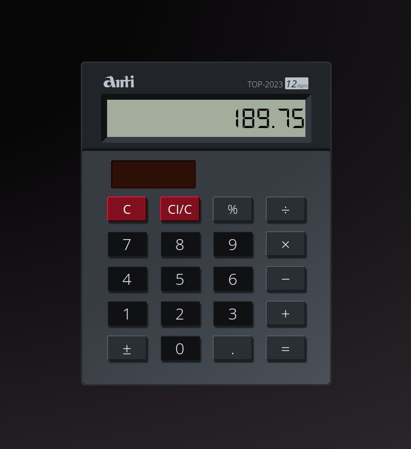

## Project: Simple Calculator

### Description

A simple calculator built with vanilla **HTML**, **CSS**, and **JavaScript** as part of [The Odin Project curriculum](https://www.theodinproject.com/lessons/foundations-calculator).

The calculator **evaluates only one single pair of numbers at a time**.

You can use it either by clicking on the buttons or by typing on your keyboard.

I was trying to recrate the look of a **Canon AS-120** calculator I have lying around at home.
It mimics the Canon calculator "behavior" - the displayed numbers "blink" when you hit an operator key, it returns "E" when the result's more than 12 digits, etc.
Since the display only shows the current number and not the operators I decided to add a little highlight feature to the relative buttons so as to make it clear what the user's last choice is.

The calculator is responsive and can be used on small screens/mobile devices.

**Live preview:** [here](https://antikun.github.io/calculator/).

### Aims
As the last project in the Fundamentals part of the Odin Project, this is aimed at putting together everything that I've learned so far.

### Results

#### Screenshots

* Got more comfortable at using **object literals** and **arrays**, while trying to keep the global scope as clear as possible.
* Learned how to add **keyboard support** using the correct event listeners.
* Got better(quicker) at **refactoring** the code.
* Improved my understanding of **CSS pseudo classes**.

### Things to improve
* Add more features - like chaining operations that follow order of precedence, using parentheses, etc.
* Try to adhere to the DRY rule better and write cleaner/reusable code.